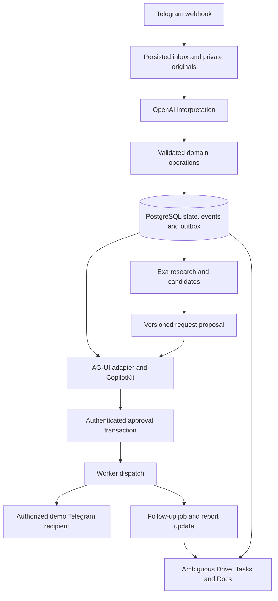

# System overview

Ground holds construction records. OpenAI interprets inputs, Exa finds public material sources, Ambiguous receives an office projection, and CopilotKit presents live state and decisions.

The webhook authenticates the channel and durably accepts input before acknowledging it. Media handling and models run asynchronously. The model returns proposals with evidence and missing fields. Server code resolves permissions, calculates quantities and applies valid operations.

One transaction commits each indivisible operation, its events and outbox rows. Independent changes in the same report can succeed separately. A blocked consumption must not roll back an independent issue or falsify its status.

After stock consumption commits, supplier research and office synchronization can run concurrently. A task can be locally ready while remote synchronization is pending. Approval commits before dispatch. The worker checks the current run, proposal version, content hash and recipient again immediately before claiming a send.

The API and worker share one backend package. Use the same database, contracts and module functions, not inter-service HTTP. The frontend reads persisted snapshots and a replayable AG-UI stream; browser closure cannot discard a task, approval or scheduled job.
